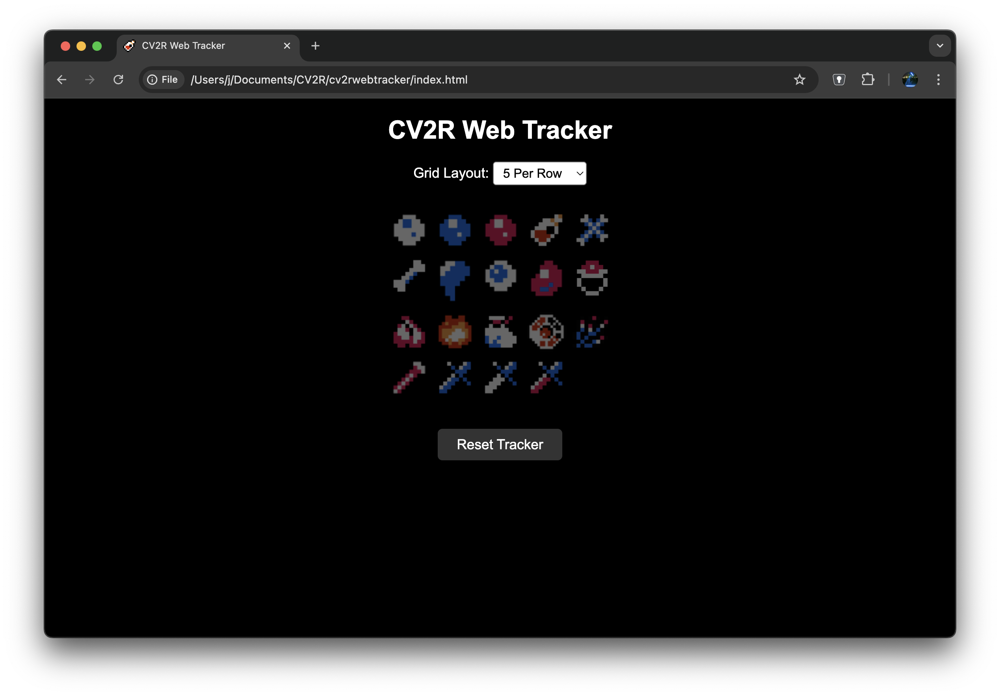
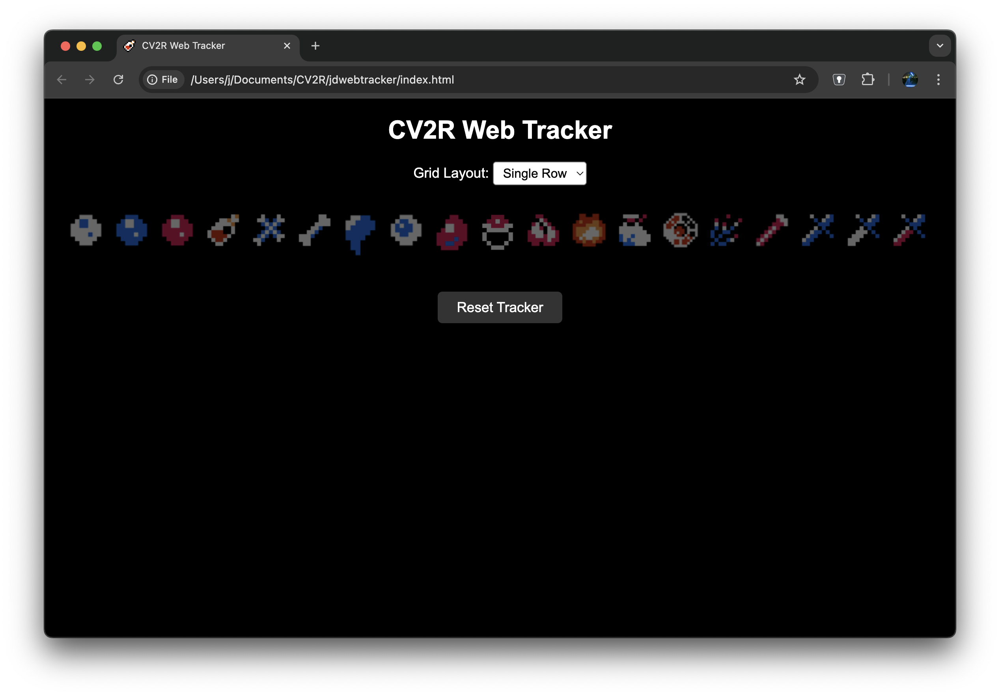

CV2R Web Tracker — External App State Integration

This repository contains a small web page (`index.html`) that displays a grid of icons which can be darkened or shown in full colour. This change adds a simple local WebSocket/HTTP server (`server.js`) so an external process running on the same machine can broadcast its state and update the page in real time.

How it works
- `server.js` runs an Express HTTP server and a WebSocket server on port 3000.
- The web page connects via WebSocket to `ws://localhost:3000` and applies updates when it receives a message like `{ "darkened": [true,false,true,...] }`.
- Any external app can POST to `http://localhost:3000/update` with the above JSON to broadcast to connected pages.

Quick start

1. Install Node dependencies

```bash
cd /path/to/cv2rwebtracker
npm install
```

2. Start the server

```bash
npm start
```

3. Open the page in a browser

Open `http://localhost:3000/index.html` in your browser. The page will connect to the WebSocket server and update when state is posted.

Example: macOS external updater

Below is a simple example showing how a macOS script could check whether a given application is frontmost and POST the tracker state to the server. This is only an example — adapt your own app's logic to produce a boolean array that matches the number/order of images in `index.html`.

AppleScript + bash (example):

```bash
#!/usr/bin/env bash
# Example: toggle the first icon to full colour when 'Notes' is frontmost
APP_NAME="Notes"
is_front=$(/usr/bin/osascript -e "tell application \"System Events\" to (name of first application process whose frontmost is true) is \"${APP_NAME}\"")

if [ "$is_front" = "true" ]; then
  # example: only first icon is lit
  payload='{"darkened": [false, true, true, true, true, true, true, true, true, true, true, true, true, true, true, true, true, true, true]}'
else
  payload='{"darkened": [true, true, true, true, true, true, true, true, true, true, true, true, true, true, true, true, true, true, true]}'
fi

curl -s -X POST -H "Content-Type: application/json" -d "$payload" http://localhost:3000/update
```

Alternative approaches
- Use a native IPC method (named pipes, Unix domain sockets, shared memory) if you need lower latency or tighter integration.
- On Windows you could use Win32 APIs or a small local program to POST state to the server.

Security note
- This demo binds to localhost only. If you expose the server to other networks, add authentication and CSRF protections.

Next steps
- If you want, I can add an example Python updater or a small compiled helper that watches an application and posts state automatically.
# FCEUX integration example

To integrate with FCEUX (NES emulator) you can use the provided Lua script `fceux/fceux_poster.lua`.

1. Copy `fceux/fceux_poster.lua` into FCEUX's macros/autorun folder (or open it via File → Lua → New Lua Script in FCEUX).
2. Edit the `addresses` table in the Lua script to match the memory addresses you want to monitor for your game.
3. Start the Node server:

```bash
npm start
```

4. Run the Lua script in FCEUX. It will poll the configured addresses each frame and POST `{ "darkened": [...] }` to `http://127.0.0.1:3000/update` whenever the state changes.

Notes:
- The script uses `socket.http` and `dkjson` available in FCEUX's Lua environment. If your FCEUX build differs, you may need to adapt the networking code.
- Adjust the `memory_to_states` mapping function to match how your game's memory values should map to the tracker icons (true = darkened, false = lit).

# CV2R Web Tracker

This is a simple web-based item tracker for Castlevania 2 Randomizer. It's based on Kaelari's Autotracker, but runs in a browser and doesn't auto-update.

Grid Layout


Single Row

